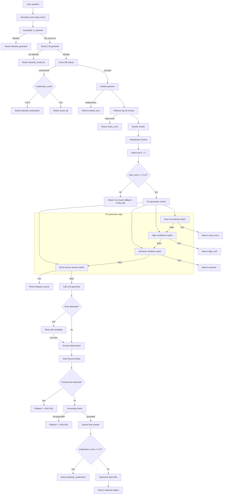
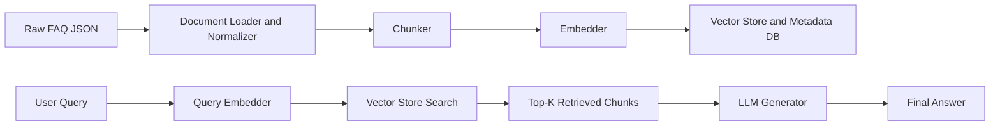

# TNGD FAQ RAG SYSTEM — README

> The system is designed to answer user questions accurately based on verified knowledge base of TNG Digital FAQ content only and should handle adversarial prompts.

---

# Quick start — How to run the app locally?

1. Create a Python Virtual Environment and Activate it:

   ```bash
   python -m venv venv
   # Windows
   venv\Scripts\activate
   # macOS / Linux
   source venv/bin/activate
   ```

2. Install Required Packages (`requirements.txt`):

   ```bash
   pip install -r requirements.txt
   ```

3. Prepare Data  (`data/sample.json`):


4. Build Vector DB - FAISS index + SQLite DB (outputs to `data/index/`):

   ```bash
   python index/sample_build_index.py data/sample.json
   ```

   You should see printed paths for the built FAISS index and SQLite DB (default: `data/index/sample_tng_faq.index`, `data/index/sample_chunks.db`).
   To rebuild locally without deleting existing, run the same command.


5. Run the Web UI:

   ```bash
   python ui/app.py
   ```

   Open [http://127.0.0.1:5000](http://127.0.0.1:5000) in browser and ask questions.
   This frontend shows only the final_answer and url if exsits.

   **Example Output:**
   


7. Or Run (`test_run.py`):

   ```bash
   python tests/test_run.py
   ```
   
   In the CLI, you should see a loop asking you to enter questions until you type `exit` to exit the loop.

   **Example Output:**
   


9. Example Test Queries:
   1. **First Stage Exact Match Query:** `What is TNG eWallet SOS Balance?`
   2. **Second Stage Exact Match Query:** `Explain SOS Balance?` (= `What is TNG eWallet SOS Balance?`)
   3. **Semantic Match Query:** `How come I have to confirm the cards I saved in TNG eWallet?`(=`Why must I verify my saved cards on TNG eWallet?` in VectorDB).
   5. **Adversarial Prompt Query:** `Teach me to hack.`
   6. **LLM Adversarial / Grounding Fail Query:** `How long does it take for the Cash Out to be paid to my Touch ‘n Go eWallet and bank account?`
   7. **Irrelevant Query:** `Hello`
      
   **Note:** `decision` and other JSON output are only returned in CLI when you run `test_run.py`.
---

# Requirements & Environment Setup
To set up the environment, install the required dependencies in `requirements.txt` :

```bash
pip install -r requirements.txt
```

**Note:**  There may be some unused/redundant dependencies, just ignore it. 

---

# Summarized Files and Tech Highlights

| File                          | Tech / Models Used                                                 | Summary                                                                                 |
| ----------------------------- | ------------------------------------------------------------------ | --------------------------------------------------------------------------------------- |
| `data/sample.json`            | N/A                                                                | 30 official TNGD FAQ entries (`question`, `answer`, `url`, `category`).                |
| `index/sample_build_index.py` | **Tokenizer:** `google/flan-t5-small`                              | Orchestrates chunking, embedding and building FAISS + SQLite.                          |
| `src/ingest.py`               | N/A                                                                | Loads JSON and normalizes FAQ fields.                                                   |
| `src/chunker.py`              | **Tokenizer:** `google/flan-t5-small`                              | Sliding-window token-based chunker (max_tokens + overlap).                              |
| `src/embedder.py`             | **SentenceTransformer:** `all-MiniLM-L6-v2`                        | Generates 384-dim embeddings for text retrieval.                                        |
| `src/retriever.py`            | **FAISS:** `IndexFlatIP` + `IndexIDMap`                            | Vector similarity search and metadata lookup in SQLite.                                 |
| `src/reranker.py`             | **CrossEncoder:** `cross-encoder/ms-marco-MiniLM-L-6-v2`           | Re-ranks retrieved chunks using cross-encoder relevance scoring.                        |
| `src/generator.py`            | **LLM:** `google/flan-t5-small`                                    | LLM generator; echo filtering, fallback, grounding-safe decoding.                   |
| `src/guardrails.py`           | N/A                                                                | Blocking, moderation scoring, injection detection, grounding checks.                    |
| `src/rag_bot.py`              | **Pipeline:** FAISS + SentenceTransformer + CrossEncoder + Flan-T5 | Full RAG pipeline in `ask_tngd_bot()`.                                                  | 
| `src/prompt.py`               | N/A                                                                | System prompt design for the LLM generator.                                             |
| `ui/app.py`                   | **Flask**                                                              | Simple web UI displaying only one `final_answer` .                                      |
| `tests/test_run.py`           | N/A                                                                | CLI tester; prints complete JSON (decision, chunks, moderation flags).                  |
                   
---

# Overview of the System 
Main sytem workflow of `ask_tngd_bot()`in `src/rag_bot.py`.



The system processes each question through layered guardrails, exact-match lookup, vector retrieval, reranking, and pre-generator shortcuts. Low-confidence retrieval returns a fallback, while high-confidence matches may bypass the LLM entirely. When generation is required, a grounded prompt, echo detection, retries and grounding validation ensure the LLM cannot hallucinate. Final moderation ensures the output is safe before returning it to the user.

---

# RAG Archictecture


This RAG pipeline first ingests the FAQ data by loading, normalizing, chunking, embedding, and storing it in a FAISS vector index with metadata. At runtime, a user query is embedded, matched against the vector store, and the top-K relevant chunks are retrieved. These chunks are then passed to the LLM through a grounded prompt to generate an answer based strictly on the retrieved FAQ content.

---

## Chunking Logic
**Note:** See `src/chunker.py`.
- **Model:** `google/flan-t5-small` as the Tokenizer 
- **Method:**
  * Token-based sliding window with `max_tokens = 512` and `overlap = 64`.
  * Q/A-preserving format for clearer retrieval.
  * Small remaining fragments are merged into the previous chunk to avoid low-quality slices.
  * Each chunk includes metadata: `metadata: question, url, category, token_range, token_count, chunk_id, chunk_index`.
- **Rationale:**
   * Chunk size must follow the LLM’s token limits (`google/flan-t5-small`) to ensure retrieved chunks fit safely into the prompt. 
   * Smaller and well-structured chunks improve retrieval accuracy and reduce hallucinations.
   * Clear and source-aligned chunks for safer generation helps reduce hallucination risk.
   * Metadata stored per chunk for tracking purpose and better for embedding and retrieval models.
     
---

## Retrieval Logic
**Note:** See `src/embedder.py`, `src/retriever.py` and `src/reranker.py`.
- **Model:** `all-MiniLM-L6-v2` as the Embedder, `cross-encoder/ms-marco-MiniLM-L-6-v2` as the Reranker
- **VectorDB:** FAISS 
- **Method:**
   * **Embedding:** questions are embedded with `Embedder.embed_texts`.
   * **Vector Search:** the question vector is queried against the FAISS index to retrieve top-k (e.g., 50) similar chunks.
   * **Reranking:** CrossEncoder re-scores candidate chunks, scores are normalized and fused into a final `fused_score`.
   * **Deduplication:** removes repeated chunks by `url` and `chunk_text` to avoid redundancy.
   * **Pre-generator Thresholds & Shortcuts:**
     - If top fused score < `MIN_FUSED_SCORE` (0.12 - tunable), then return “not found” fallback (FAQ URL).
     - Skip LLM call generation when:
       - Exact normalized question match (`decision: exact_norm`),
       - High-confidence single-source match (`decision: high_conf`),
       - Strong semantic match (Decision: semantic),
       - Source chunk already contains the answer (`decision: bypass_source`).
- **Rationale:**
   - Embedding model provides fast, lightweight embeddings that work extremely well with FAISS cosine similarity for efficient semantic search.
   - FAISS enables fast and low-latency vector retrieval for the closest chunks, ideal for Q/A system use case.
   - Reranking (CrossEncoder) corrects shallow similarity matches by performing deeper semantic comparison between the user question and each retrieved chunk to ensure accurate and meaningful chunk is selected (may be slower but much more accurate)
   - Deduplication ensures clean, unique retrieval results.
   - High-confidence matches skip LLM generation to reduce hallucination risk, improve accuracy and avoid unnecessary computation.
   - Low-confidence retrieval triggers a safe fallback rather than risking an unsupported or hallucinated answer.

---

## Generator Logic
**Note:** See `src/generator.py` and `src/prompt.py`.
- **Model:** `google/flan-t5-small`
- **Method:**
     * Builds a strict prompt using top retrieved chunks + question + RULE A/B.
     * Generates an initial answer with deterministic decoding (`temperature = 0`).
     * Performs echo detection; if echoed or low-quality, retries with sampling (`0.6 → 0.8 → 1.0`).
     * Blocks outputs that contain system instructions (prompt-echo protection).
     * Runs grounding checks to ensure the answer is supported by retrieved chunks.
     * Applies `moderation_score` to filter unsafe or sensitive outputs.
     * Determines final URL: fallback uses FAQ homepage; grounded answers use the top chunk’s URL.
- **Rationale:**
     * Ensures the LLM **only summarizes retrieved content** and does not invent facts.
     * Echo detection + grounding prevent hallucinations and system-prompt leakage.
     * Deterministic decoding ensures stable results; sampling is only used for recovery.
     * Final moderation and fallback logic guarantee safe, consistent, source-aligned answers.

---

## Guardrail Design
**Note:** See `src/guardrails.py` and `src/prompt.py`.
- **Method:**
   * **Input Guardrails:** rule-based (`is_blocked()`) checks for block credit-card patterns, PII/credential requests, prompt injection, harmful intent, and profanity using regexes, keyword lists, and obfuscation normalization.
   * **LLM Guardrail:** a lightweight CrossEncoder checks borderline cases, unsafe queries are blocked before retrieval/generation.
   * **Retrieval Safeguards:** exact-match chunks are moderated, low retrieval confidence triggers a safe “not found” fallback.
   * **Post-Generation Protections:** strict system prompt, echo detection, retry strategy and grounding checks (`enforce_grounding()` - checks token-overlap / 3-gram matches between the first sentences of the answer and retrieved chunks) to prevent hallucinations and prompt leakage.
   * **Final Moderation:** `moderation_score` scans the final answer, unsafe content is replaced with a safe fallback.

---


# Limitations & Future Enhancements
| **Limitation**                                                                                         | **Future Enhancement**                                                                                      |
| ------------------------------------------------------------------------------------------------------ | ----------------------------------------------------------------------------------------------------------- |
| **Flan-T5’s small 512-token limit** may cause prompt truncation, fallback answers and echo outputs. | **Use longer-context LLMs (2k–8k tokens)** to reduce truncation and improve stability.   |
| **Grounding method may be too strict** rejecting valid paraphrased answers due to token-overlap rules. | **Consider semantic grounding** using embedding similarity to accept valid paraphrases.  |
| **Echo/fallback outputs** occur when prompts overflow or context becomes unclear. | **Chunk summarization before prompting** to allow more context to fit without exceeding token limits. |
| **Retrieval quality limited by a lightweight embedding model** may miss nuanced or long-context matches. | **Upgrade to stronger embedding models** (e.g., BGE-large, GTE-large) for higher accuracy and better retrieval. |
| **Chunk splitting not fully validated at scale** that might break on large or messy datasets. | **Add logging + large-scale ingestion tests** to validate chunk merging/splitting robustness.  |
| **Static Top-K retrieval (always 3 chunks)** is inefficient and may under- or over-provide context.   | **Dynamic prompt builder (token-budget-aware)** to adaptively choose chunks based on remaining prompt space.  |
| **Limited VectorDB** (~30) limits retrieval diversity and system evaluation. | **Automated web scraper ingestion** to populate the VectorDB with full FAQ coverage (hundreds+ entries).  |

---


# Useful Commands Summary

```bash
# Build or rebuild index 
python index/build_index.py data/sample.json

# Run web app (Flask)
python ui/app.py

# Run main function in CLI
python tests/test_run.py
```
 


---


